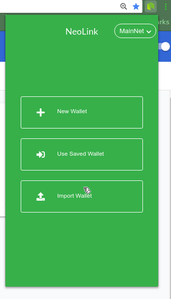

# NeoLink

This is a Chrome extension wallet for the Neo Smart Economy.

Currently the project is undergoing heavy development. When running in development, the extension popup can
be perceived as slow to start. Please be aware of this when running the unpacked extension build.



## Current Noteworthy Features

* Send Neo or Gas to an address
* Easily switch between MainNet, TestNet & Custom User-Configurable Private Nets
* Test invoke smart contracts, with variadic arguments, to determine gas cost and test
* Send invoke smart contracts
* Authorize both types of smart contract invocations as requested by third-party dApp
* SemVer 2.0 compliant http://semver.org/
* Persistent storage of user configuration
* Create, Import, and Open Wallets (includes encrypted WIF aka NEP-2)
* Transaction confirmation with password dialog
* Transaction review with timestamps and remark support
* Balance home screen now includes any NEP-5 tokens listend by Neoscan
* Neoscan.io (MainNet, TestNet, and custom) support

## Future Features

* Transaction fee support
* Add progress indicator for any actions that don't have them now to show user something is happening
* Add dark theme
* Contact book that remembers addresses used
* Configurable watch wallet for any saved addresses to display balances all in one view
* Claim Gas
* Ledger hardware support
* NEP-6
* Any ideas from the community!

## Roadmap

* Product Landing Page
* Firefox plug-in
* Version 1.0 Release (Release packed plug-in on Google and Firefox)

## Setup

`npm install`

`npm run start` (for development with live reload)

`npm run build` (production)

Your unpacked extension will be in the ./build/ folder.

See https://developer.chrome.com/extensions/getstarted#unpacked for instructions on manually loading an unpacked Chrome extension in developer mode.

Tip: If you inspect the extension with developer tools, the extension will stay open instead of closing as is default Chrome behavior on events outside of
the extension window.

## Use NeoLink with your dApp

Add the following code to your dApp:

```
<input type='text' id='contractScriptHash' />
<input type='text' id='operationName' />
<input type='text' id='runInvokeArgument1' />
<input type='text' id='runInvokeArgument2' />
<input type='text' id='assetType' />
<input type='text' id='assetAmount' />

<button id="runInvokeButton">Invoke</button>
<script>
document.getElementById("runInvokeButton").addEventListener("click",
    function() {
      var scriptHash = document.getElementById("contractScriptHash").value
      var operation = document.getElementById("operationName").value
      var args = []
      args.concat(document.getElementById("runInvokeArgument1").value)
      args.concat(document.getElementById("runInvokeArgument2").value)
      var type = document.getElementById("assetType").value
      var amount = document.getElementById("assetAmount").value

      var invocationObject = {
        'scriptHash': scriptHash, // Your contract's script hash.
        'operation': operation,   // Operation as defined in your contract.
        'args': args,             // or other utility methods from neon-js for these arguments.
        'assetType': type,        // NEO or GAS currently.
        'assetAmount': amount     // Amount, decimals allowed for GAS.
      }

      window.postMessage({ type: "NEOLINK_SEND_INVOKE", text: invocationObject }, "*");
}, false);
</script>
```

## NeoLink - Demo

* Install NeoLink
  * Clone github.com/cityofzion/neolink/
  * Follow the instructions there to install and build
  * Login with encrypted WIF (wallet needs a balance of TestNet gas)
* Visit sendeo.surge.sh and watch the video to learn how it works.
* Code available at [on Github](https://github.com/slipo/sendeo)
